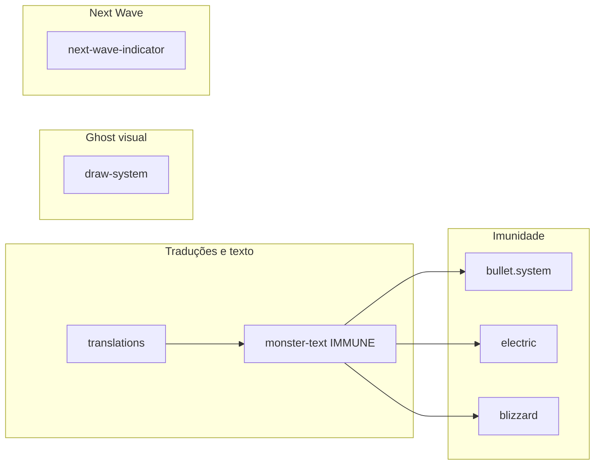

# Plano: Feedback visual do sistema elementar

## Contexto

- **Imunidade**: Em [damage.helpers.ts](src/Game/common/combat/damage.helpers.ts), `resolveDamage` já retorna 0 para ataque físico vs ghost (linhas 115–120), mas não há sinalização visual — o projétil acerta e nada aparece.
- **Ghost no monstro**: O sprite é criado em [draw-system.mixin.ts](src/Game/Character/Monster/mixins/draw-system.mixin.ts) via `monsterWalkAnimations[type]`; não há tratamento por `element` (opacidade/aura).
- **Next Wave**: Em [next-wave-indicator.component.tsx](src/Game/Hud/NextWaveIndicator/next-wave-indicator.component.tsx) o elemento vem de `config.element ?? "neutral"`. As waves em `src/Game/common/hordes/` não definem `element` no `MonsterConfig`; o monstro em runtime usa `config.element ?? MONSTER_TYPE_ELEMENT[config.type]` em [monster.entity.ts](src/Game/Character/Monster/monster.entity.ts) (linha 95). Ou seja, no HUD o elemento fica sempre "neutral" por fallback.

---

## 1. Indicador de imunidade (dano físico vs ghost)

**Objetivo:** Quando um ataque físico atinge um ghost e o dano efetivo é 0, mostrar texto flutuante “Imune” (i18n) no monstro.

**Abordagem:**

- Adicionar chave de tradução (ex.: `damageImmune` / `Imune`) em [translations.constants.ts](src/common/constants/translations.constants.ts) (EN, PT, ES).
- Criar texto reutilizável para imunidade em [monster-text.ts](src/Game/Text/monster-text.ts), no mesmo estilo de `STUN_RESIST_TEXT` / `SLOW_RESIST_TEXT`, usando `showFloatingText` (já usado para resist em [monster.entity.ts](src/Game/Character/Monster/monster.entity.ts)).
- Nos pontos que aplicam dano, quando `effectiveDamage === 0` **e** for o caso físico vs ghost (ex.: `attacker.damageKind === "physical" && defender.element === "ghost"`), chamar `showFloatingText(IMMUNE_TEXT, duration, monster)` no **monstro** que recebeu o hit (para AOE, em cada monstro que ficou com dano 0 por imunidade).

**Arquivos a alterar:**

- [src/common/constants/translations.constants.ts](src/common/constants/translations.constants.ts) — novas chaves `damageImmune`.
- [src/Game/Text/monster-text.ts](src/Game/Text/monster-text.ts) — constante `IMMUNE_TEXT` (ou similar) com estilo adequado.
- [src/Game/Character/Tower/mixins/bullet.system.ts](src/Game/Character/Tower/mixins/bullet.system.ts) — em `applyDamage()`: no ramo single-target, se `effectiveDamage === 0` e físico vs ghost, `showFloatingText(..., this.target)`; no ramo AOE, dentro do `for`, se `effectiveDamage === 0` e físico vs ghost, `showFloatingText(..., monster)`.
- [src/Game/Character/Tower/strategy/aim-shoot/electric.ts](src/Game/Character/Tower/strategy/aim-shoot/electric.ts) — no `forEach`, se `effectiveDamage === 0` e físico vs ghost, `showFloatingText(..., monster)`.
- [src/Game/Skills/Blizzard/blizzard-effect.entity.ts](src/Game/Skills/Blizzard/blizzard-effect.entity.ts) — onde chama `resolveDamage` e `takeDamage`, se dano 0 por físico vs ghost, `showFloatingText(..., monster)`.

Não é obrigatório expor um helper `isPhysicalImmune(attacker, defender)` em damage.helpers; a condição pode ficar nos call sites para evitar acoplamento com a camada de texto.

---

## 2. Indicador visual único para monstro ghost (opacidade + aura)

**Objetivo:** Monstros com `element === "ghost"` terem opacidade reduzida e uma aura de “fumaça” para identificação rápida.

**Abordagem:**

- **Opacidade:** No [draw-system.mixin.ts](src/Game/Character/Monster/mixins/draw-system.mixin.ts), em `setWalkAnimation()` (ou no método que atribui o sprite ao monstro), após `this.monster.addChild(this.sprite)`, se `this.monster.element === "ghost"`, definir `this.sprite.alpha` (ex.: 0.82–0.88). Garantir que isso rode sempre que a animação de walk for definida (único ponto central de criação do sprite).
- **Aura de fumaça:** Adicionar um efeito visual simples por baixo do sprite:
  - Opção A (recomendada): Um `Graphics` (Pixi) como filho do monstro, atrás do sprite (insertar antes ou `addChildAt(aura, 0)`): 1–2 elipses/círculos com fill cinza-claro ou branco e alpha baixo (ex.: 0.15–0.25), levemente maiores que o tile, para simular “fumaça”. Opcional: animação sutil (ex.: alpha ou scale em loop) no `update` do monstro ou via Ticker.
  - Opção B: Segundo sprite estático de “fumaça” se existir asset; senão, Graphics é suficiente e evita novos assets.

O “aura” pode ficar encapsulado no mesmo `RenderSystem`: método tipo `applyGhostVisuals()` chamado no final de `setWalkAnimation()` quando `element === "ghost"`, criando e posicionando o Graphics e ajustando `sprite.alpha`. Manter referência ao Graphics para destruir em `onDeathCallbacks`.

**Arquivos a alterar:**

- [src/Game/Character/Monster/mixins/draw-system.mixin.ts](src/Game/Character/Monster/mixins/draw-system.mixin.ts) — após criar e adicionar o sprite, se ghost: set `sprite.alpha`; criar e adicionar aura (Graphics); em `onDeathCallbacks`, remover/destruir a aura se existir.

---

## 3. Next Wave exibir elemento correto (ghost em vez de neutral)

**Objetivo:** O painel “NEXT WAVE” deve mostrar o elemento real da próxima onda (ex.: Ghost para Slime Boned), usando o mesmo critério do monstro em runtime.

**Abordagem:**

- No [next-wave-indicator.component.tsx](src/Game/Hud/NextWaveIndicator/next-wave-indicator.component.tsx), derivar o elemento como na entidade do monstro: `config.element ?? MONSTER_TYPE_ELEMENT[config.type] ?? "neutral"`.
- Importar `MONSTER_TYPE_ELEMENT` de [monsters.constants.ts](src/Game/common/constants/monsters.constants.ts) e usar `config.type` para obter o elemento quando `config.element` for undefined.

**Arquivos a alterar:**

- [src/Game/Hud/NextWaveIndicator/next-wave-indicator.component.tsx](src/Game/Hud/NextWaveIndicator/next-wave-indicator.component.tsx) — substituir `(config.element ?? "neutral")` por `(config.element ?? MONSTER_TYPE_ELEMENT[config.type] ?? "neutral")` e adicionar o import do constante.

---

## Ordem sugerida e dependências

1. Traduções + `IMMUNE_TEXT` em monster-text (base para imunidade).
2. Indicador de imunidade em bullet, electric e blizzard.
3. Ghost visual no draw-system (independente).
4. Next Wave com elemento derivado de `MONSTER_TYPE_ELEMENT[config.type]` (independente).

Nenhuma alteração em waves/mapas é necessária; o elemento continuará opcional no `MonsterConfig` e será inferido pelo tipo quando ausente.