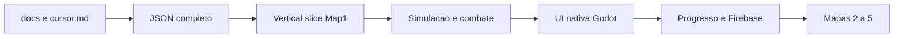

# Migração Godot 4 3D

Plano executável para reconstruir o Tower-Tatics em 3D. Regras de jogo: [`docs/`](../README.md). Não rebalancear nem “corrigir” quirks neste plano (stealth sem `reveal`, `noGoldReward` morto, AoE sem filtro air/ground, freeze L2 mais fraco, desalinhamento spawn vs path sources).

## Decisões fechadas

| Tema | Decisão |
|---|---|
| Engine | Godot **4.x** |
| Linguagem | **GDScript** |
| Repo | mesmo repositório, projeto novo em `godot/` |
| Câmera | 3D **ortográfica**, elevação ~**38°** (look 3/4 atual). Sem câmera livre na partida. |
| Dados | 2D (`src/` + export script) permanece fonte de balanceamento até o corte |
| Assets | GLB Kenney **direto** (parar bake PNG/WebP) |
| Backend | MVP offline (JSON). Firebase na fase de meta |
| Não portar | Pixi, React HUD, Howler, Capacitor, tile-size dinâmico em px, 36 frames de rotação |

## Arquitetura alvo

```
tower-tatics/
  cursor.md
  docs/                    # regras (esta pasta)
  src/                     # cliente 2D — referência até o corte
  scripts/export-godot-data.ts
  godot-export/data/       # JSON consumido pelo Godot
  godot/                   # projeto Godot 4
    project.godot
    data/                  # cópia ou link dos JSON
    scenes/
    scripts/
    assets/models/         # GLB Kenney
```

Simulação em `_physics_process` (timestep fixo). Render/UI em `_process`. Grid 15×15 com tile size **fixo** em metros (ex. 1.0). Torres = nós 3D com footprint 2×2. Pathfinding: portar o A* 12-dir (não GridMap navmesh, para preservar a regra de “não bloquear todos os spawns”).



## Fase 0 — Contrato de dados

Expandir `scripts/export-godot-data.ts` para emitir, além de mapas/waves/`constants.json`:

- `towers.json` — as 6 torres: combat, economy, upgrades L2–L6, sell_prices, heat (hoje só nas entities)
- `skills.json` — blizzard + energia (3 / 15s / custo 2)
- `player.json` — HP 100, gold 60, leak 5, max tower level 6, max equipped 4
- `progression.json` — map-rewards (mapa → torre), mapa 1 unlocked
- Manter `hordes` jogáveis **já fatiadas** no JSON que o Godot lê (ou documentar o slice no loader Godot: Map2 `slice(0,15)`, etc.)

Godot lê só JSON. Nenhum número de combate hardcoded em GDScript.

## Fase 1 — Projeto + grid

- Criar `godot/project.godot` (renderer Forward+, Android export preset depois).
- Importar GLB do Kenney Tower Defense Kit.
- Cena `Board`: 15×15 tiles, bordas bloqueadas, portais rows 4–9 nas colunas 0 e 14.
- Câmera ortográfica ~38°, zoom que mostre o tabuleiro inteiro (mobile-first).
- Picking de tile por raycast no plano do chão.
- Carregar `constants.json` + `map_1.json`.

**Done when:** tabuleiro visível em 3D, click seleciona tile.

## Fase 2 — Vertical slice (Map 1 jogável mínimo)

Escopo: Map 1, só `machine-gun`, slimes da wave 1, pathfinding, leak/HP/gold.

- A* 12-dir + `canPlaceTowerWithoutBlocking` (6 spawns → 6 portais).
- Spawn `spawn_per_side` ao longo de `spawn_duration`.
- Machine gun: range 4, 0.75 atk/s, dano 20, heat 100/10/0.08, targeting = maior progresso ao portal.
- Ouro 60, HP 100, leak −5, kill +gold.
- Game over e vitória da wave 1 (depois expandir às 10 waves).

**Done when:** dá para ganhar e perder a wave 1 do Desert com MG.

## Fase 3 — Seis torres + economia in-match

Portar da [towers.md](../game-design/towers.md) e [combat.md](../game-design/combat.md):

- `missile` (chão, AoE 3), `heavy-gun` (heat), `electric` (hit em `range+1`, stun), `freeze` (slow no primário), `anti-air` (só ar, AoE 2).
- Upgrade 1–6 com duração `3000 * 1.35^(level-1)`; não atira durante upgrade.
- Sell pre-game = `cost`; mid-game = `sell_prices[level]`.
- Shop só mostra loadout (no slice, as 6; loadout 4 entra na fase 5).
- Flags de monstro usadas no Map 1: `spawnsOnDeath`, `spawnsPerTime`, `air` (bee wave 10).

**Done when:** Map 1 completo com as 6 torres e os 11? tipos da wave set do mapa 1 (`slime`, `goblin`, `wolf`, `bee`).

## Fase 4 — Skills + UI de onda

- Energia 3 segmentos, regen 15 s, começa em 0.
- Blizzard: preview 6 tiles, duração 5 s, tick 500 ms, dano 10, slow 0.3 / linger 1.5 s, raio de hit 5.5, custo 2.
- Botão de onda: start / pause / resume / sendNext.
- Pause mid-wave bloqueia placement e seleção.
- HUD nativo (Control): HP, ouro, horde, shop, stats de torre/monstro, energy bar.
- Sem Howler: AudioStreamPlayer por grupo (Effects / Monsters / Voices / Musics) se os áudios forem copiados; senão SFX placeholder.

**Done when:** partida Map 1 com HUD e blizzard, pausável.

## Fase 5 — Meta + Firebase

- Inventário: unlocked / equipped (máx. 4) / discovered; default MG.
- Unlock de mapa e torre no clear ([progression.md](../game-design/progression.md)).
- Tela `/play` equivalente: seletor de mapa + tabs torres/skills.
- Persistência local (ConfigFile ou user:// JSON).
- Depois: Auth Google + Firestore `catalog_towers` / `catalog_missions` / `users/{uid}` — mesmo schema do 2D para não divergir o backend.
- Missões só se o catálogo remoto não estiver vazio.

**Done when:** completar Map 1 destrava Missile e Map 2; loadout de 4 torres persiste.

## Fase 6 — Mapas 2–5 + Android

- Carregar Cemetery → Hell com slice correto de waves e `wave_interval_seconds`.
- Todos os 11 tipos de monstro + flags (`stealth`, `enrageOnLowHP`, `healer`, resists, armor no-op).
- Temas visuais (tints já no JSON) e GLB de tiles por bioma se existirem no Kenney.
- Export Android nativo Godot (substitui Capacitor). Sem iOS no primeiro corte.
- 2D web pode continuar no ar até o corte; depois o Godot vira fonte de verdade dos JSON (inverter o export).

**Done when:** os 5 mapas jogáveis em device Android com a mesma progressão do 2D.

## Mapeamento de sistemas

| Sistema 2D | Destino Godot |
|---|---|
| `PlacementLayer` + A* | `Board` + `Pathfinder` (GDScript, mesma regra 12-dir) |
| `TowerCharacter` + aim-shoot | `Tower` + strategies por tipo |
| `MonsterCharacter` + mixins | `Monster` (move, health, slow, stun, spawn) |
| `CharactersLayer` quadtree | query espacial simples ou `PhysicsDirectSpaceState` |
| Zustand stores | autoloads (`GameState`, `Gold`, `SkillEnergy`, `Inventory`) |
| React HUD | cenas `Control` |
| Firestore catalog | JSON local → depois REST/SDK Firebase |
| Howler | `AudioStreamPlayer` |
| Capacitor Android | export template Godot |

## Fora de escopo deste plano

- Começar o projeto Godot (próxima etapa, após este doc).
- Rebalancear números ou corrigir quirks documentados.
- Perspectiva livre, navmesh, multiplayer, novas torres/skills.
- PWA / iOS.
